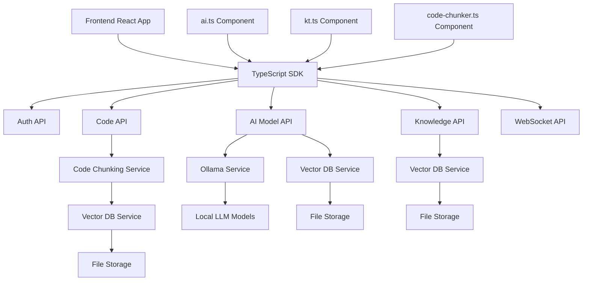

# Epic: Backend Integration and API Infrastructure

## Description

This epic focuses on building a comprehensive, scalable, secure, and resilient backend infrastructure to support the multi-agent discussion arena. Key activities include designing and implementing RESTful API endpoints for core functionalities (agent management, discussion lifecycle, message handling), setting up a robust server environment (using FastAPI for backend services), configuring database connections (e.g., PostgreSQL, MongoDB, vector databases) with appropriate schema design and connection pooling, and integrating these components seamlessly with the frontend and the core discussion management logic. The system will include AI model integration, knowledge management, code processing, and real-time communication capabilities. Emphasis will be placed on creating stateless API services where possible to enhance scalability and fault tolerance.

## User Stories

- **As a frontend developer,** I want stable and well-documented API endpoints with a strongly-typed TypeScript SDK for agent configuration, discussion initiation, and message retrieval, so I can build the user interface components efficiently and reliably.
- **As the Discussion Manager system,** I want to persist discussion state (participants, messages, context, current turn) via backend API calls, so that discussions can be paused, resumed across sessions, or recovered after interruptions.
- **As a system administrator,** I want secure authentication (e.g., JWT, OAuth) and role-based authorization implemented for all API endpoints, so that application data is protected from unauthorized access and actions.
- **As a developer,** I want comprehensive logging implemented across backend services, so I can effectively debug issues and monitor system health.
- **As an LLM integration developer,** I want standardized interfaces for model serving and streaming responses, so I can efficiently handle AI-powered interactions.
- **As a knowledge base engineer,** I want API endpoints for knowledge storage and retrieval, so I can manage semantic search and information extraction.
- **As a code analyst,** I want efficient code processing and vector database operations for semantic code analysis and search capabilities.

## API Architecture Components

### FastAPI Backend Core
- **Framework**: FastAPI with async support for high-performance API handling
- **Structure**:
  ```
  server/app/
  ├── main.py                # Application entry
  ├── dependencies.py        # Dependency injection
  ├── config.py              # Configuration management
  ├── models/                # Data models
  │   ├── auth.py           # Authentication models
  │   ├── ai.py             # AI/ML related models
  │   ├── knowledge.py      # Knowledge base models
  │   ├── code.py           # Code processing models
  ├── routes/               # API endpoints
  │   ├── auth.py           # Authentication routes
  │   ├── ai.py             # AI/ML endpoints
  │   ├── knowledge.py      # Knowledge endpoints
  │   ├── discussion.py     # Discussion endpoints
  │   ├── code.py           # Code processing endpoints
  ├── services/             # Business logic
  │   ├── ai_models.py      # LLM integration
  │   ├── vector_store.py   # Vector DB service
  │   ├── memory.py         # Memory management
  │   ├── knowledge.py      # Knowledge processing
  │   ├── code_chunker.py   # Code analysis
  │   ├── ollama.py         # Ollama service integration
  ├── core/                 # Core utilities
  │   ├── security.py       # Security utilities
  │   ├── cache.py          # Caching logic
  │   ├── monitoring.py     # API monitoring
  │   ├── websocket.py      # WebSocket handlers
  ```

### Authentication Layer
- JWT token-based authentication
- OAuth2 with Password flow
- Session management with persistence
- Role-based permissions for different user types
- Security auditing and monitoring
- Rate limiting protection

### AI Model Integration
- Ollama service integration
- Model management and lifecycle
- Streaming response handling
- Token counting and usage tracking
- Parameter validation and controls
- Model status monitoring

### Knowledge Management
- Knowledge item CRUD operations
- Semantic search capabilities
- Knowledge extraction services
- Classification system
- Source management
- Linking and relationships

### Code Processing
- Code chunking and analysis
- Embedding generation
- Vector storage and retrieval
- Semantic code search
- Batch processing for large codebases
- Code metadata extraction

### Real-time Communication
- WebSocket support for streaming agent responses
- Server-Sent Events for status notifications
- Connection management and reconnection handling
- Channel management for multiple discussions
- Progress notification system
- Client state synchronization

### TypeScript Client SDK
- Strongly-typed API client
- Request/response interceptors
- Retry and error handling
- Streaming response handlers
- Request cancellation support
- React hooks for common operations

## Component Interaction Diagram



## Potential Pitfalls

- **Inadequate API Design:** Creating endpoints that are too granular or too coarse, leading to chatty interactions or tight coupling between frontend and backend.
- **Poor Database Schema:** Inefficient schema design or lack of proper indexing causing performance bottlenecks.
- **Insufficient Error Handling:** Lack of standardized error responses and inadequate handling of edge cases.
- **Security Vulnerabilities:** Failure to implement proper authentication, authorization, input validation, or rate limiting.
- **Scalability Bottlenecks:** Architecture choices that hinder the system's ability to handle increasing load.
- **Vendor Lock-in:** Over-reliance on specific cloud provider services without considering portability.
- **LLM Response Handling:** Inadequate streaming implementation causing delays or UI freezes.
- **Vector Database Performance:** Inefficient vector operations affecting semantic search capabilities.

## Good Practices

- **Standard API Design:** Adhere to RESTful principles with clear naming conventions and consistent response structures.
- **API Versioning:** Implement versioning from the start to manage breaking changes gracefully.
- **Stateless Services:** Design backend services to be stateless when possible for improved scalability.
- **Comprehensive Logging & Monitoring:** Integrate structured logging and monitoring tools.
- **Testing Strategy:** Implement unit tests, integration tests, and contract testing.
- **Security First:** Implement security best practices including HTTPS, secure auth, and input validation.
- **Infrastructure as Code:** Use tools like Terraform or Pulumi for infrastructure management.
- **Database Migrations:** Use tools like Alembic for systematic schema management.
- **Documentation:** Maintain comprehensive OpenAPI/Swagger documentation.

## Definition of Done (DoD)

- All core API endpoints implemented, tested, and documented
- Backend services containerized with Docker
- Deployment configurations created for all environments
- Authentication and authorization implemented and enforced
- Structured logging and monitoring implemented
- Database schema finalized with migration scripts
- Security review completed and vulnerabilities addressed
- TypeScript SDK published and documented
- Integration tests passing for all major flows
- Performance benchmarks met for vector operations
- Real-time communication system tested at scale
- Developer documentation and examples provided
- E2E smoke tests passing in staging environment

## End-to-End (E2E) Flows

1. **Agent Creation and Configuration**
2. **Discussion Initialization and Management**
3. **Message Processing and Turn Progression**
4. **Knowledge Storage and Retrieval**
5. **Code Analysis and Semantic Search**
6. **Real-time Updates and Streaming**
7. **Authentication and Session Management** 