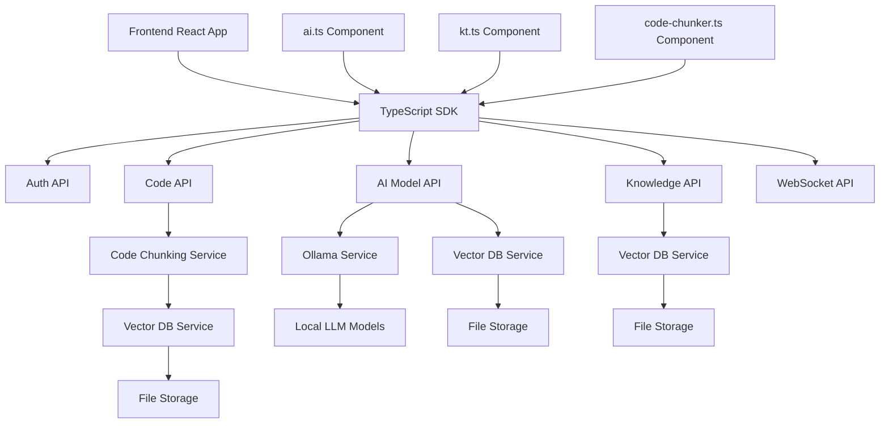

# API Integration Epics

## Overview
This document outlines the primary epics for implementing the API integration layer of the AUI system. The integration layer connects the React frontend with the FastAPI backend and handles all AI/ML operations, knowledge management, and semantic code processing.

## Epic 1: FastAPI Backend Core Setup

**Description:** Establish the foundational FastAPI application with proper structure, configuration, and core middleware.

**Key Tasks:**
- Set up FastAPI application structure with proper async support
- Implement configuration management system
- Create dependency injection framework
- Establish error handling middleware
- Implement security middleware
- Add monitoring and logging infrastructure

**Component Interactions:**
- Creates the platform for all other API services to build upon
- Provides consistent error handling and logging for all routes
- Serves as the gateway for frontend-to-backend communication

## Epic 2: Authentication and Security System

**Description:** Implement robust authentication, authorization, and security features for the API.

**Key Tasks:**
- Create JWT token management system
- Implement OAuth2 with Password flow
- Build session handling and persistence
- Develop role-based permission system
- Add rate limiting protection
- Implement security auditing

**Component Interactions:**
- Interfaces with `ai.ts` for secure LLM access
- Controls access to sensitive knowledge store operations
- Enforces rate limits on computationally expensive operations

## Epic 3: AI Model Integration API

**Description:** Create the API layer for interacting with local and remote LLM providers.

**Key Tasks:**
- Implement Ollama service integration
- Add model management endpoints
- Create streaming response handlers
- Implement token counting and usage tracking
- Build parameter validation and controls
- Develop model status monitoring

**Component Interactions:**
- Directly interfaces with `ai.ts` LLMProvider implementations
- Provides the backend for all LLM operations
- Manages model lifecycle and resource allocation
- Streams responses back to frontend UI

## Epic 4: Knowledge Management API

**Description:** Build API endpoints for storing, retrieving, and managing knowledge artifacts.

**Key Tasks:**
- Implement knowledge item CRUD operations
- Create knowledge search endpoints
- Build knowledge extraction services
- Develop knowledge classification system
- Add knowledge linking and relationships
- Implement knowledge source management

**Component Interactions:**
- Connects with `kt.ts` knowledge management system
- Provides backend for knowledge storage and retrieval
- Interfaces with vector database for semantic search
- Supports knowledge extraction from various sources

## Epic 5: Code Processing and Vector Database API

**Description:** Develop API services for code parsing, chunking, embedding, and vector search operations.

**Key Tasks:**
- Implement code chunking endpoints
- Create embedding generation services
- Build vector storage and retrieval API
- Develop semantic search capabilities
- Add batch processing for large codebases
- Implement code metadata extraction

**Component Interactions:**
- Works with `code-chunker.ts` for semantic code processing
- Provides backend for vector storage and retrieval
- Handles embedding generation for code snippets
- Enables semantic code search functionality

## Epic 6: Real-time Communication System

**Description:** Implement WebSocket and SSE support for real-time interactions and streaming.

**Key Tasks:**
- Create WebSocket connection management
- Implement streaming response handlers
- Build progress notification system
- Develop client state synchronization
- Add reconnection and error recovery
- Create channel management system

**Component Interactions:**
- Enables streaming responses from AI models
- Provides real-time updates for long-running operations
- Supports interactive debugging and monitoring
- Allows pushing notifications to clients

## Epic 7: TypeScript Client SDK

**Description:** Build a strongly-typed TypeScript client SDK for frontend integration.

**Key Tasks:**
- Create core API client with TypeScript types
- Implement request/response interceptors
- Build retry and error handling logic
- Develop streaming response handlers
- Add request cancellation support
- Create React hooks for common operations

**Component Interactions:**
- Provides the frontend interface to all backend services
- Works with React components for data fetching
- Handles streaming responses for chat interfaces
- Manages authentication and session state

## Epic 8: Testing and Documentation

**Description:** Develop comprehensive testing, monitoring, and documentation for the API.

**Key Tasks:**
- Create unit tests for all services
- Build integration tests for API flows
- Implement load testing framework
- Generate OpenAPI documentation
- Add performance monitoring
- Create developer guides and examples

**Component Interactions:**
- Ensures reliability of all API services
- Provides quality metrics for development
- Creates clear documentation for frontend developers
- Establishes monitoring for production services

## Interaction Diagram

