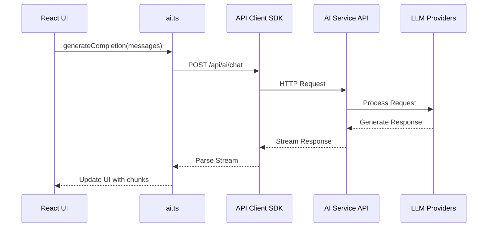
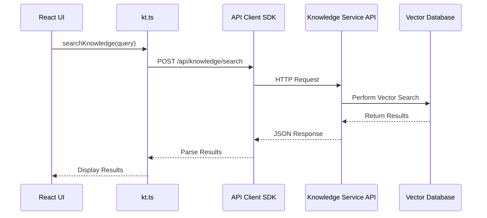
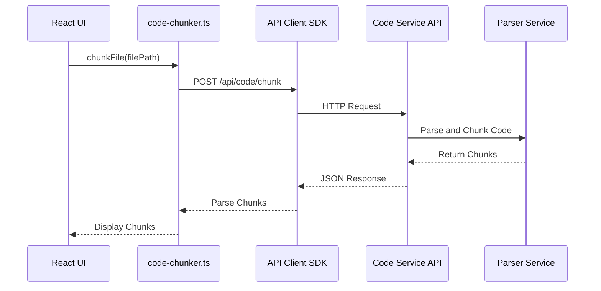

# Component Interaction Map

## Project Roadmap

The project has been reorganized into a logical implementation sequence. See [PROJECT-ROADMAP.md](/PROJECT-ROADMAP.md) for the complete implementation plan and phase structure.

This document details the key component interactions in the AUI system, focusing on how the frontend TypeScript components interact with the FastAPI backend services.

## Core Components

### Frontend TypeScript Components

1. **AI Module (ai.ts)**
   - **Purpose**: Manages LLM providers, model selection, request configuration, and response handling
   - **Key Classes**: 
     - `LLMProvider` - Interface for all LLM providers
     - `OllamaProvider` - Implementation for local Ollama models
     - `ONNXProvider` - Implementation for ONNX-based models
     - `LLMProviderFactory` - Factory for creating provider instances

2. **Knowledge Module (kt.ts)**
   - **Purpose**: Handles knowledge capture, classification, storage, and retrieval
   - **Key Classes**:
     - `KnowledgeManager` - Core class for knowledge operations
     - `KnowledgeItem` - Type representing a piece of knowledge
     - `KnowledgeSearchOptions` - Parameters for knowledge search

3. **Code Processing Module (code-chunker.ts)**
   - **Purpose**: Parses and chunks code into semantic units for embedding
   - **Key Classes**:
     - `CodeChunker` - Handles code parsing and chunking
     - `CodeChunk` - Type representing a semantic code unit
     - `CodeChunkType` - Enumeration of chunk types (file, class, function, etc.)

### Backend FastAPI Services

1. **AI Model Service**
   - **Purpose**: Provides API endpoints for LLM operations
   - **Key Endpoints**:
     - `/api/ai/models` - List available models
     - `/api/ai/completions` - Generate text completions
     - `/api/ai/chat` - Chat completions with history
     - `/api/ai/embeddings` - Generate embeddings

2. **Knowledge Service**
   - **Purpose**: Manages knowledge storage and retrieval
   - **Key Endpoints**:
     - `/api/knowledge/items` - CRUD operations for knowledge items
     - `/api/knowledge/search` - Semantic search in knowledge base
     - `/api/knowledge/extract` - Extract knowledge from sources

3. **Code Processing Service**
   - **Purpose**: Handles code parsing, chunking, and semantic operations
   - **Key Endpoints**:
     - `/api/code/chunk` - Parse and chunk code
     - `/api/code/search` - Semantic code search
     - `/api/code/metadata` - Extract code metadata

4. **WebSocket Service**
   - **Purpose**: Provides real-time communication
   - **Key Channels**:
     - `/ws/ai/stream` - Stream AI completions
     - `/ws/notifications` - System notifications
     - `/ws/status` - Operation status updates

## Component Interactions

### AI Processing Interactions

### Knowledge Management Interactions

### Code Processing Interactions

## API Integration Points

The following table maps frontend components to their corresponding backend API endpoints:

| Frontend Component | Backend Endpoint | Purpose |
|-------------------|------------------|---------|
| `ai.ts::generateResponse()` | `/api/ai/chat` | Generate LLM responses |
| `ai.ts::countTokens()` | `/api/ai/tokens` | Count tokens in text |
| `kt.ts::searchKnowledge()` | `/api/knowledge/search` | Search knowledge base |
| `kt.ts::addKnowledgeItem()` | `/api/knowledge/items` | Add knowledge items |
| `code-chunker.ts::chunkFile()` | `/api/code/chunk` | Parse and chunk code |
| `code-chunker.ts::createIndex()` | `/api/code/index` | Create searchable code index |

## Data Flow Patterns

### Streaming Response Pattern

For long-running operations, especially LLM completions:

1. Client initiates request via REST
2. Server responds with operation ID
3. Client connects to WebSocket with operation ID
4. Server streams results via WebSocket
5. Client processes chunks incrementally

### Batch Processing Pattern

For operations on multiple items like codebase indexing:

1. Client submits batch job
2. Server processes items in background 
3. Server sends progress updates via WebSocket
4. Client displays progress and results as they complete

## Future Integration Considerations

1. **Authentication Propagation**: How credentials flow from frontend to backend
2. **Caching Strategy**: Client-side vs server-side caching decisions
3. **Error Handling**: Standardized error formats and recovery strategies
4. **Versioning**: API versioning approach for backward compatibility
5. **Performance Optimization**: Strategies for reducing latency 